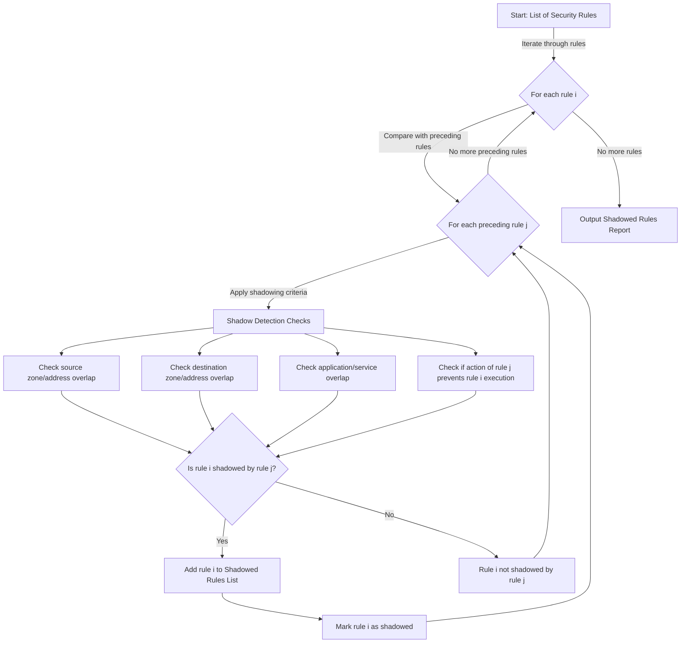

[TOC]

## Description

Rules Checker started as a tool to detect overlapping firewall rules, known as shadowing. During development, it evolved into a straightforward framework that allows to define different checks very easily.




## Example output

```shell
[09:34:45] INFO     Starting shadowed Rules detection
[09:34:45] INFO     Number of Rules to check: 3
[09:34:45] INFO     Number of Checks: 7
[09:34:45] INFO     - check_action
[09:34:45] INFO     - check_application
[09:34:45] INFO     - check_services
[09:34:45] INFO     - check_source_zone
[09:34:45] INFO     - check_destination_zone
[09:34:45] INFO     - check_source_address
[09:34:45] INFO     - check_destination_address
[09:34:45] INFO     Finished shadowed Rules detection. Analyzing results
[09:34:45] INFO     [1/3][rule-example1] Checking rule against 0 preceding Rules
[09:34:45] INFO     [1/3][rule-example1] Checking rule finished.
[09:34:45] INFO     [2/3][rule-example2] Checking rule against 1 preceding Rules
[09:34:45] INFO     [2/3][rule-example2] Checking rule finished.
[09:34:45] INFO     [3/3][rule3-allow-dns] Checking rule against 2 preceding Rules
[09:34:45] INFO     [3/3][rule3-allow-dns] Checking rule finished.
[09:34:45] INFO     Shadowed rules detection complete
[09:34:45] INFO     [rule-example2] Rule is shadowed by: rule-example1
[09:34:45] INFO     [rule3-allow-dns] Rule not shadowed
[09:34:45] INFO     [rule3-allow-dns] Rule not shadowed
```

## Raw results

```python

{
    'rule-example1': {},
    'rule-example2': {
        'rule-example1': {
            'check_action': (True, 'Actions match'),
            'check_application': (True, "Preceding rule contains rule's applications"),
            'check_services': (True, "Preceding rule and rule's services are the same"),
            'check_source_zone': (True, 'Source zones are the same'),
            'check_destination_zone': (True, 'Source zones are the same'),
            'check_source_address': (True, 'Preceding rule allows any source address'),
            'check_destination_address': (True, 'Preceding rule allows any destination address')
        }
    },
    'rule3-allow-dns': {
        'rule-example1': {
            'check_action': (True, 'Actions match'),
            'check_application': (False, "Preceding rule does not contain all rule's applications"),
            'check_services': (True, "Preceding rule and rule's services are the same"),
            'check_source_zone': (False, 'Source zones differ'),
            'check_destination_zone': (True, 'Source zones are the same'),
            'check_source_address': (True, 'Preceding rule allows any source address'),
            'check_destination_address': (True, 'Preceding rule allows any destination address')
        },
        'rule-example2': {
            'check_action': (True, 'Actions match'),
            'check_application': (False, "Preceding rule does not contain all rule's applications"),
            'check_services': (True, "Preceding rule and rule's services are the same"),
            'check_source_zone': (False, 'Source zones differ'),
            'check_destination_zone': (True, 'Source zones are the same'),
            'check_source_address': (False, 'Source addresses not covered at all'),
            'check_destination_address': (False, 'Destination addresses not covered at all')
        }
    }
}


```

## Models

```python
--8<-- "code/shadowing_rules/fsr/models.py"
```

## Resolve addresses

```python
--8<-- "code/shadowing_rules/fsr/lookup.py"
```

## Finding shadowing rules

```python
--8<-- "code/shadowing_rules/fsr/shadower.py"
```

## Checks

```python
--8<-- "code/shadowing_rules/fsr/check.py"
```

## Evaluate check results

```python
--8<-- "code/shadowing_rules/fsr/evaluate.py"
```

## Utils

```python
--8<-- "code/shadowing_rules/fsr/utils.py"
```

## CLI

```python
--8<-- "code/shadowing_rules/fsr/__main__.py"
```

## Unit tests

```python
--8<-- "code/shadowing_rules/fsr/test.py"
```
