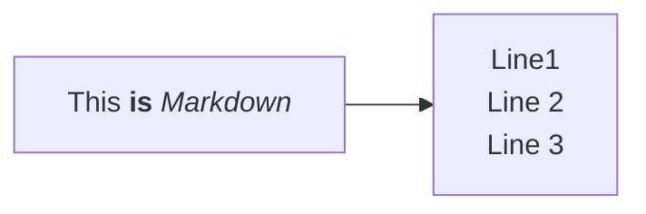
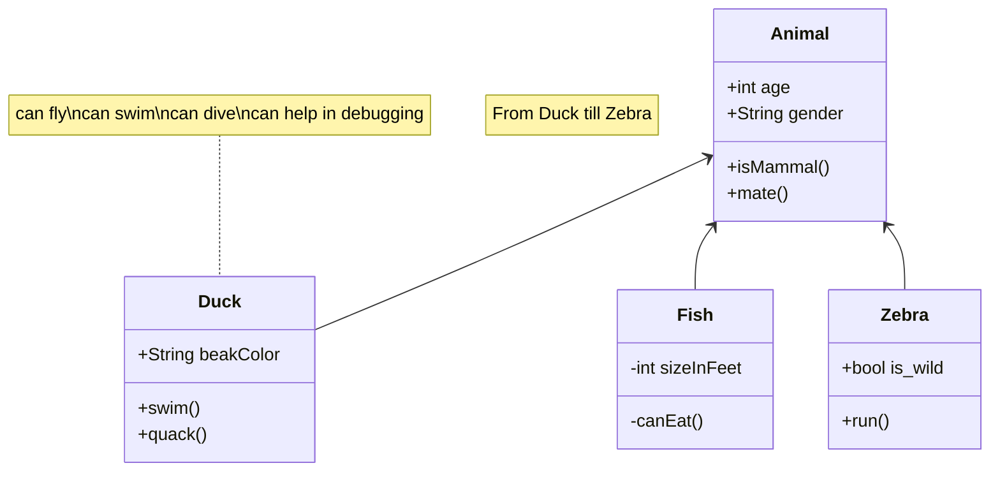

Title: Markdown in Pelican  
Date: 2023-06-15  
Status: draft

Examples of Markdown formatting available in Pelican.

## Typography

```

## Second level

### Third level

#### Forth level
```

## Second level

### Third level

#### Forth level

```
**Bold text**

_Italic text_

~~Strikethrough text~~
```

**Bold text**

_Italic text_

~~Strikethrough text~~

## Quotes

```
> This is single line quote
```

> This is single line quote

```
> This is multiline quote.
> It spans on few lines.
> at least should be.
> It has to be long enough.
```

> This is multiline quote.
> It spans on few lines.  
> at least should be.  
> It has to be long enough.

## Code

```
Inline `code text`.
```

Inline `code text`.

```
\`\`\`python
@task
def clean(c):
    """Remove generated files"""
    path = CONFIG['deploy_path']
    if os.path.isdir(path):
        print(f"Removing directory: {path}")
        shutil.rmtree(path)
        print(f"Creating a empty folder: {path}")
        os.makedirs(path)
    print(f"No directory as: {path}")
\`\`\`

```

```python
@task
def clean(c):
    """Remove generated files"""
    path = CONFIG['deploy_path']
    if os.path.isdir(path):
        print(f"Removing directory: {path}")
        shutil.rmtree(path)
        print(f"Creating a empty folder: {path}")
        os.makedirs(path)
    print(f"No directory as: {path}")
```

## Admonitions

Available types:

- `danger`
- `error`
- `warning`
- `caution`
- `attention`
- `important`
- `note`
- `hint`
- `tip`

```markdown
!!! danger
This is admonition type: `danger` without title.

!!! tip "Custom tip title"
This is admonition type: `tip` with custom title.

!!! warning ""
This is admonition type: `warning` has no title.
```

!!! danger
This is admonition type: `danger` without title.

!!! tip "Custom tip title"
This is admonition type: `tip` with custom title.

!!! warning ""
This is admonition type: `warning` has no title.

## Progress Bars

```markdown
[=0% "0%"]
[=50% "50%"]
[=100% "100%"]
```

[=0% "0%"]

[=50% "50%"]

[=100% "100%"]

## Mermaidjs

Flowcharts



Class


